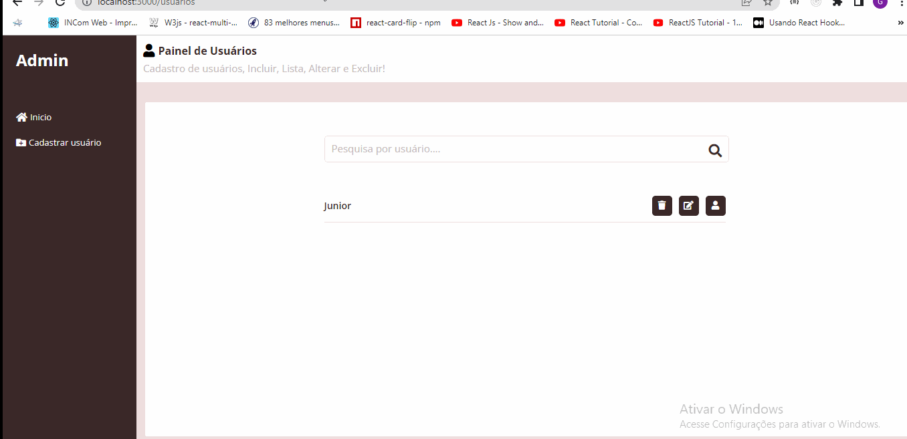

 <h4 align="center">
   
</h4>

- Clone o projeto: `git clone https://github.com/Gabriel200395/desafio_frontend.git`

## 💻 Frontend
- Entrar na pasta do projeto: `cd frontend`
- usuario(admin) senha(admin)
- Iniciar a aplicação: `yarn start`
- baixe na aplicação:  `yarn` 
- Irá abrir uma página no browser (se não abrir, vá até [http://localhost:3000\login](http://localhost:3000\login)).

## 💻 Backend
- Entrar na pasta do projeto: `cd backend`
- Iniciar a aplicação: `json-server --watch db.json --port 3004`
- baixe na aplicação:  `npm install -g json-server` 
- Irá abrir uma página no browser (se não abrir, vá até [http://localhost:3004\users](http://localhost:3004/users)).

## :pencil: Autor

<table>
  <tr>
    <td align="center"><a href="https://github.com/Gabriel200395"> <b>Gabriel Souza</b></a> </td>
  <tr>
</table>
